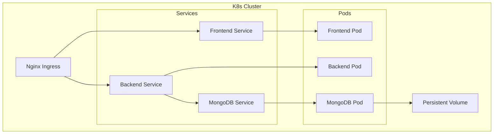

# System Architecture

## 🏗️ High-Level Design

This document describes the architectural design of the eStore application, including service interactions, data flow, and deployment strategies.

```mermaid
graph TD
    Client[Client (Browser/Mobile)]
    LB[Load Balancer / Ingress]
    FE[Frontend Service (React)]
    BE[Backend Service (Node/Express)]
    DB[(MongoDB Primary)]
    Stripe[Stripe Payment Gateway]
    Email[SMTP Email Service]
    Logs[Logging & Monitoring]

    Client -->|HTTPS| LB
    LB -->|/| FE
    LB -->|/api/*| BE
    FE -->|API Calls| LB
    BE -->|Read/Write| DB
    BE -->|Process Payment| Stripe
    BE -->|Send Notifications| Email
    BE -->|Async Logs| Logs
```

---

## 📂 Project Structure

This project follows a monorepo-style structure with distinct `backend` and `frontend` directories.

### Backend (`/backend`)
*   **`config/`**: Configuration files (DB connection, Swagger, etc.).
*   **`controllers/`**: (Business Logic) currently integrated into routes, but logic separation pattern is encouraged.
*   **`middleware/`**: Express middleware (Auth, Error Handling, Rate Limiting, Logging).
*   **`models/`**: Mongoose schemas defining data structure.
*   **`routes/`**: API route definitions mapping endpoints to handlers.
*   **`utils/`**: Helper functions (Email, Logger).
*   **`tests/`**: Jest unit and integration tests.
*   **`jobs/`**: Background jobs (Cron tasks).

### Frontend (`/frontend`)
*   **`public/`**: Static assets (HTML, manifests).
*   **`src/components/`**: Reusable UI components.
*   **`src/pages/`**: Route-level page components.
*   **`src/contexts/`**: React Context for global state (Auth, Cart, Wishlist).
*   **`src/services/`**: API service modules (Axios instances).
*   **`src/utils/`**: Utility functions.

---

## 🧩 Component Interactions

### 1. Frontend (React)
-   **Responsibility**: Renders the user interface, manages client-state, and interacts with the backend API.
-   **Technology**: React 18, Framer Motion (Animations), TailwindCSS (Styling).
-   **State Management**: React Context API is used for global state (User, Cart).
-   **Deployment**: Served via Nginx in Docker or static hosting (Vercel/Netlify).

### 2. Backend (Node.js/Express)
-   **Responsibility**: Handles business logic, authentication, data processing, and integrations.
-   **Technology**: Node.js, Express, Mongoose, JWT.
-   **Security**: Helmet (Headers), Rate Limiting, CORS, XSS Sanitization.
-   **Key Modules**:
    -   `Auth`: Handles registration, login, JWT issuance.
    -   `Products`: CRUD operations for catalog.
    -   `Orders`: Order processing and status management.
    -   `Payment`: Stripe intent creation and confirmation.

### 3. Database (MongoDB)
-   **Responsibility**: Persists application data.
-   **Configuration**: Replica Set recommended for production.

---

## 🗃️ Data Models

### User
*   `name`: String
*   `email`: String (Unique, Indexed)
*   `password`: String (Hashed via bcrypt)
*   `role`: Enum ['user', 'admin']
*   `isActive`: Boolean
*   `isEmailVerified`: Boolean (for verify flow)

### Product
*   `name`: String (Indexed for search)
*   `description`: String
*   `price`: Number
*   `category`: String (Indexed)
*   `stock`: Number
*   `imageUrl`: String
*   `averageRating`: Number

### Order
*   `user`: ObjectId (Ref: User)
*   `items`: Array of objects (product, name, price, quantity)
*   `totalAmount`: Number
*   `shippingAddress`: Object
*   `paymentStatus`: Enum ['pending', 'paid', 'failed']
*   `orderStatus`: Enum ['processing', 'shipped', 'delivered', 'cancelled']
*   `stripePaymentIntentId`: String

---

## 🔌 API Design

The API follows RESTful principles.

### Response Format
Standardized JSON response for consistency:
```json
{
  "success": true,
  "data": { ... }, // For successful payload
  "count": 10,     // For list endpoints
  "message": "..." // Optional message
}
```

### Error Handling
Errors return a standard format:
```json
{
  "success": false,
  "message": "Error description",
  "stack": "..." // Only in development
}
```

### Authentication
*   **Strategy**: Bearer Token (JWT).
*   **Flow**: Login returns `token`. Client sends `Authorization: Bearer <token>` header for protected routes.

---

## 🔄 Data Flow: Purchase Lifecycle

1.  **User** browses products (GET `/api/products`).
2.  **User** adds items to cart (Local State / Context).
3.  **User** proceeds to checkout.
4.  **Frontend** requests Payment Intent (POST `/api/orders/create-payment-intent`).
5.  **Backend** communicates with **Stripe** to get `clientSecret`.
6.  **User** enters card details and confirms payment via **Stripe.js**.
7.  **Frontend** sends confirmation to Backend (POST `/api/orders/confirm-payment`).
    *   *Note*: Backend verifies payment status with Stripe before finalizing.
8.  **Backend** creates Order in **MongoDB**.
9.  **Backend** triggers email via **Nodemailer**.
10. **Backend** returns success; Frontend clears cart and shows success page.

---

## ☁️ Deployment Architecture

### Kubernetes Cluster
The application is designed to run in a Kubernetes environment.



### Technology Choices & Rationale

| Component | Choice | Rationale |
|-----------|--------|-----------|
| **Frontend** | React | Component-based, vast ecosystem, declarative UI. |
| **Backend** | Node.js/Express | Non-blocking I/O ideal for API requests, unified JS stack. |
| **Database** | MongoDB | Flexible schema for product catalogs, high scalability. |
| **Containerization** | Docker | Consistency across dev/prod environments. |
| **Orchestration** | Kubernetes | Automated scaling, self-healing, industry standard. |
| **Payment** | Stripe | Developer-friendly, robust security compliance. |
| **Monitoring** | Sentry / New Relic | Real-time error tracking and performance profiling. |

---

## 🔒 Security Architecture

1.  **Transport**: All traffic encrypted via TLS/SSL.
2.  **Authentication**: Stateless JWT Authentication.
3.  **Input Validation**: `express-validator` used on inputs to prevent injection.
4.  **Headers**: `helmet` sets secure HTTP headers.
5.  **Rate Limiting**: Applied to API routes to prevent abuse (DoS).
6.  **Secrets Management**: Kubernetes Secrets / Environment Variables.
7.  **Network**: Backend/DB not exposed directly to public internet (ClusterIP).
