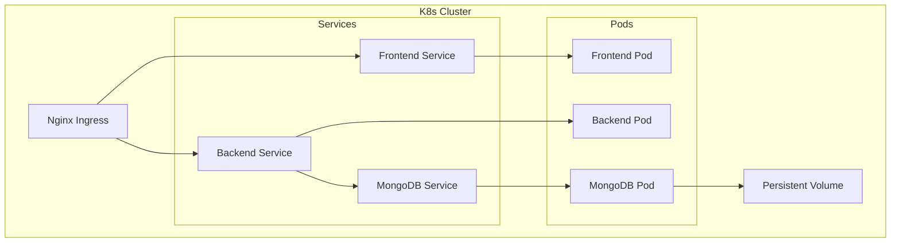

# System Architecture

## 🏗️ High-Level Design

This document describes the architectural design of the eStore application, including service interactions, data flow, and deployment strategies.

```mermaid
graph TD
    Client[Client (Browser/Mobile)]
    LB[Load Balancer / Ingress]
    FE[Frontend Service (React)]
    BE[Backend Service (Node/Express)]
    DB[(MongoDB Primary)]
    Stripe[Stripe Payment Gateway]
    Email[SMTP Email Service]

    Client -->|HTTPS| LB
    LB -->|/| FE
    LB -->|/api/*| BE
    FE -->|API Calls| LB
    BE -->|Read/Write| DB
    BE -->|Process Payment| Stripe
    BE -->|Send Notifications| Email
```

---

## 🧩 Component Interactions

### 1. Frontend (React)
-   **Responsibility**: Renders the user interface, manages client-state, and interacts with the backend API.
-   **Technology**: React 18, Framer Motion (Animations), TailwindCSS (Styling).
-   **Deployment**: Served via Nginx in Docker or static hosting (Vercel/Netlify).

### 2. Backend (Node.js/Express)
-   **Responsibility**: Handles business logic, authentication, data processing, and integrations.
-   **Technology**: Node.js, Express, Mongoose, JWT.
-   **Key Modules**:
    -   `Auth`: Handles registration, login, JWT issuance.
    -   `Products`: CRUD operations for catalog.
    -   `Orders`: Order processing and status management.
    -   `Payment`: Stripe intent creation and confirmation.

### 3. Database (MongoDB)
-   **Responsibility**: Persists application data.
-   **Data Models**: Users, Products, Orders, Reviews.
-   **Configuration**: Replica Set recommended for production.

---

## 🔄 Data Flow

### Purchase Flow
1.  **User** browses products (GET `/api/products`).
2.  **User** adds items to cart (Local State).
3.  **User** proceeds to checkout.
4.  **Frontend** requests Payment Intent (POST `/api/orders/create-payment-intent`).
5.  **Backend** communicates with **Stripe** to get `clientSecret`.
6.  **User** enters card details and confirms payment via **Stripe.js**.
7.  **Frontend** sends confirmation to Backend (POST `/api/orders/confirm-payment`).
8.  **Backend** validates payment status with **Stripe**.
9.  **Backend** creates Order in **MongoDB**.
10. **Backend** triggers email via **Nodemailer**.

---

## ☁️ Deployment Architecture

### Kubernetes Cluster
The application is designed to run in a Kubernetes environment.



### Technology Choices & Rationale

| Component | Choice | Rationale |
|-----------|--------|-----------|
| **Frontend** | React | Component-based, vast ecosystem, declarative UI. |
| **Backend** | Node.js/Express | Non-blocking I/O ideal for API requests, unified JS stack. |
| **Database** | MongoDB | Flexible schema for product catalogs, high scalability. |
| **Containerization** | Docker | Consistency across dev/prod environments. |
| **Orchestration** | Kubernetes | Automated scaling, self-healing, industry standard. |
| **Payment** | Stripe | Developer-friendly, robust security compliance. |

---

## 🔒 Security Architecture

1.  **Transport**: All traffic encrypted via TLS/SSL.
2.  **Authentication**: Stateless JWT Authentication.
3.  **Secrets Management**: Kubernetes Secrets / Environment Variables.
4.  **Network**: Backend/DB not exposed directly to public internet (ClusterIP).

