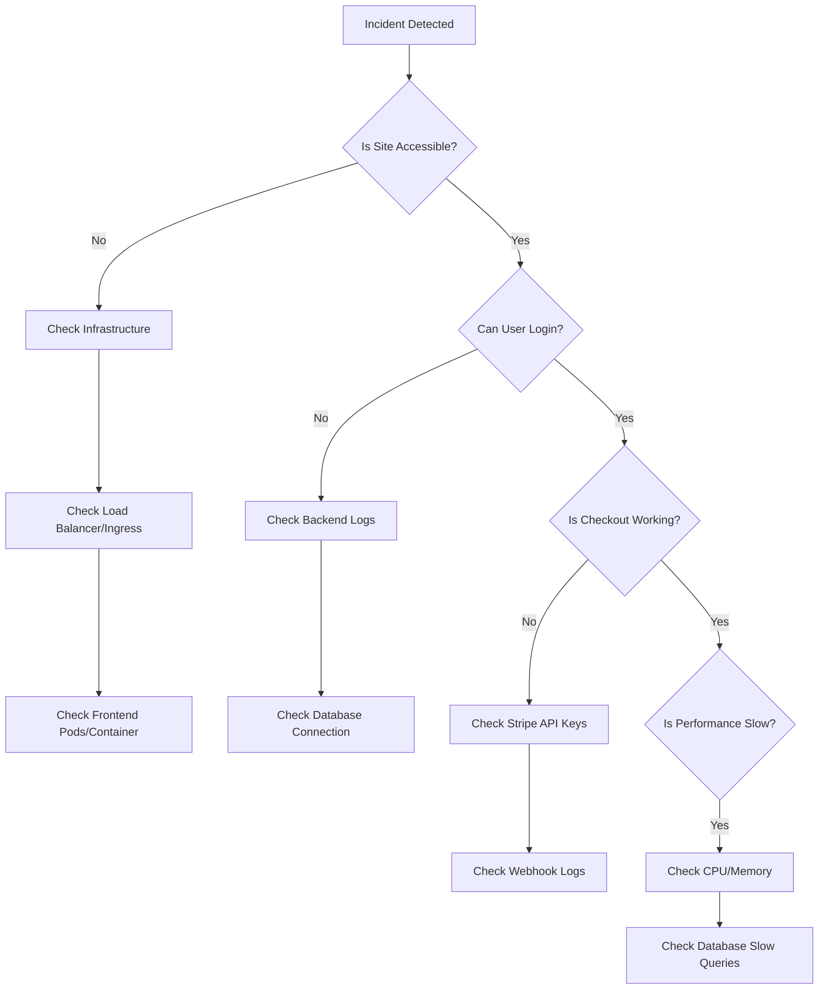

# Production Runbook & Incident Response Guide

## 🚨 1. Emergency Contacts

| Role | Name | Phone | Email | Availability |
|------|------|-------|-------|--------------|
| **On-Call Engineer** | [Name] | [Phone] | oncall@estore.com | 24/7 |
| **Engineering Lead** | [Name] | [Phone] | lead@estore.com | 9am-6pm M-F |
| **CTO** | [Name] | [Phone] | cto@estore.com | Emergency Only |
| **DevOps** | [Name] | [Phone] | devops@estore.com | 9am-6pm M-F |

**Escalation Policy:**
1.  **Level 1 (On-Call)**: Immediate response to alerts.
2.  **Level 2 (Lead)**: If unresolved after 30 mins or requires approval.
3.  **Level 3 (CTO/Exec)**: If major outage persists > 2 hours or data breach suspected.

---

## 🛑 2. Incident Response Process

### Phase 1: Detection & Triage
*   **Alerts**: Sentry (Errors), New Relic (Performance), Uptime Robot (Availability).
*   **Severity Levels**:
    *   **SEV-1 (Critical)**: System down, critical data loss, security breach. (SLA: 15m response)
    *   **SEV-2 (High)**: Core feature broken (Checkout, Login), payment failures. (SLA: 30m response)
    *   **SEV-3 (Medium)**: Non-critical bugs, performance degradation. (SLA: 4h response)

### Phase 2: Response & Mitigation
1.  **Acknowledge**: Mark alert as "In Progress".
2.  **Status Page**: Update stakeholders/users if SEV-1/2 (status.estore.com).
3.  **Investigate**: Use logs and metrics to identify root cause.
4.  **Mitigate**: Apply temporary fix (Restart, Rollback, Scale) to restore service.

### Phase 3: Resolution & Recovery
1.  **Fix**: Implement permanent fix.
2.  **Verify**: Ensure system stability.
3.  **Monitor**: Watch for regression.

### Phase 4: Post-Mortem
*   Required for all SEV-1 and SEV-2 incidents.
*   Create a "Post-Mortem Report" within 24 hours.

---

## 🔍 3. Troubleshooting Flowchart



---

## 🛠️ 4. Common Issues & Solutions

### A. Database Connection Failure
*   **Symptoms**: `500 Internal Server Error`, Logs: `MongooseServerSelectionError`.
*   **Diagnosis**:
    ```bash
    docker logs estore-backend
    # or
    kubectl logs -l app=backend
    ```
*   **Resolution**:
    1.  Check MongoDB Status: `docker ps` / `kubectl get pods`.
    2.  Check Network Policies (Allow 0.0.0.0/0 for Atlas).
    3.  Verify `MONGO_URI` credentials in Secrets.

### B. High API Latency / Timeouts
*   **Symptoms**: Slow page loads, `504 Gateway Timeout`.
*   **Diagnosis**:
    1.  Check Resource Usage: `docker stats`.
    2.  Check New Relic transaction traces.
*   **Resolution**:
    1.  **Scale Up**: Adds pods/replicas.
    2.  **Restart**: `kubectl rollout restart deployment backend`.

### C. Deployment Failure
*   **Symptoms**: Boot loop, immediate crash after deploy.
*   **Resolution**:
    *   Run **Rollback**: See [ROLLBACK.md](./ROLLBACK.md).

### D. Payment Failures (Stripe)
*   **Symptoms**: `400 Bad Request` on checkout, "Payment Failed" UI error.
*   **Diagnosis**:
    1.  Check Backend Logs for Stripe Error Code.
    2.  Verify `STRIPE_SECRET_KEY` is correct/valid.
*   **Resolution**:
    *   Rotate keys if compromised.
    *   Check Stripe System Status (status.stripe.com).

### E. Frontend Assets 404
*   **Symptoms**: White screen, chunks failed to load.
*   **Resolution**:
    *   Clear Cloudflare/Nginx Cache.
    *   Rebuild and redeploy frontend container.

---

## 🔄 5. Operational Tasks

### Backup & Restore
*   **Strategy**: Daily automated snapshots (Atlas / S3).
*   **Restore Procedure**:
    1.  **Locate Backup**: Find latest valid dump.
    2.  **Download**: `aws s3 cp s3://estore-backups/latest.dump .`
    3.  **Restore**:
        ```bash
        mongorestore --uri="$MONGO_URI" --drop ./latest.dump
        ```
    4.  **Verify**: Count documents in `users` and `orders` collections.

### Accessing Logs
*   **Docker**: `docker logs -f <container_name>`
*   **Kubernetes**: `kubectl logs -f <pod_name>`
*   **Files**: `/app/logs/application.log` inside container.

---

## 📞 6. On-Call Procedures

### Shift Responsibilities
*   Keep phone ON with loud notifications.
*   Acknowledge alerts within 15 minutes.
*   Join "War Room" (Slack/Teams channel) during incidents.

### Handoff Checklist
*   [ ] Review active alerts.
*   [ ] Review pending maintenances.
*   [ ] Confirm access to all tools (AWS, Atlas, Stripe).
*   [ ] Notify team of handoff in #engineering.

### Tooling Links
*   [Monitoring Dashboard (New Relic)](https://newrelic.com)
*   [Error Tracking (Sentry)](https://sentry.io)
*   [Status Page](https://status.estore.com)
*   [Cloud Provider Console](https://railway.app)
